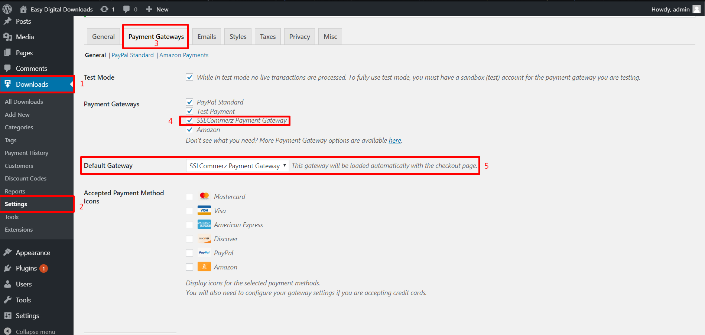
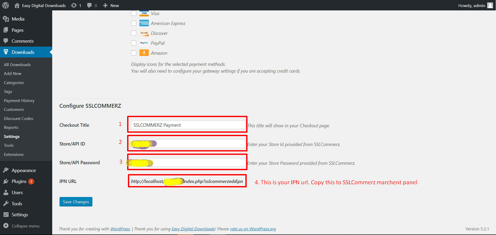

# SSLCommerz For Easy Digital Downloads (EDD)

> Easy Digital Downloads plugin for SSLCommerz payment gateway with IPN Support.

## Getting Started

### Prerequisites

1. Wordpress V5.2.*
2. Easy Digital Downloads V2.9.*
3. cURL php extension.

### Installation

1. Download zip file or Clone the repository.
2. Directly upload zip file to Wordpress admin panel ```Plugins > Add New > Upload Plugin``` button.
3. Activate the plugin through the 'Plugins' menu in admin panel.
4. If you unable to do above steps Unzip if downloaded zip file.
5. Move the whole directory to ```/wp-content/plugins/```
6. Activate the plugin through the 'Plugins' menu in admin panel.

### Configuration

1. Open Wordpress Admin Panel.
2. Navigate to ```Downloads > Settings > Payment Gateways``` tab.

* 

3. Scroll down the page, In the **Configure SSLCOMMERZ** section input your **Checkout Title**, **Store/API ID**, **Store/API Password** provided from SSLCommerz Operation.

> Note: Don't use  your merchant panel user id & password in the **Store/API ID**, **Store/API Password** field.

* 

4. Must input **Checkout Title** otherwise it will not show any title in checkout page.
5. Find the IPN URL. It will look like ```[your site]/index.php?sslcommerzeddipn```. Copy this URL, it will be needed in the next step.
6. Login to your SSLCommerz merchant panel. Navigate to ```My Stores > IPN Settings``` from menu. Find ```IPN at HTTP Listner``` section at the bottom of the page.
7. Paste the URL obtained from step 5. Check the box labeled ```Enable HTTP Listner```. Click ```Save```.
8. Setup is complete. Check if everything is working properly.

#### Note: For live mode uncheck ```Test Mode``` and use your Live Store ID & Password.

## FAQ

### What is Easy Digital Downloads?
> In their words "From eBooks, to WordPress plugins, to PDF files and more, we make selling digital products a breeze. Easy Digital Downloads is simple to use and free to download." [More](https://easydigitaldownloads.com/) 

### What is SSLCommerz?
> SSLCOMMERZ is the first payment gateway in Bangladesh opening doors for merchants to receive payments on the internet via their online stores.

### What is a Payment Gateway?
> Payment Gateway is a service that allows merchant to accept secure credit card transactions online. It essentially connects a merchant website to a transaction processor like bank to take payment from a customer for an order.

### SSLCommerz Developers Page
> [Check SSLcommerz](https://developer.sslcommerz.com/docs.html)

> [Register for Sandbox](https://developer.sslcommerz.com/registration/)


## Contributors

* Prabal Mallick
* Email Us: integration@sslcommerz.com (For any query)
* More info: https://www.sslcommerz.com

© 2019 SSLCOMMERZ ALL RIGHTS RESERVED